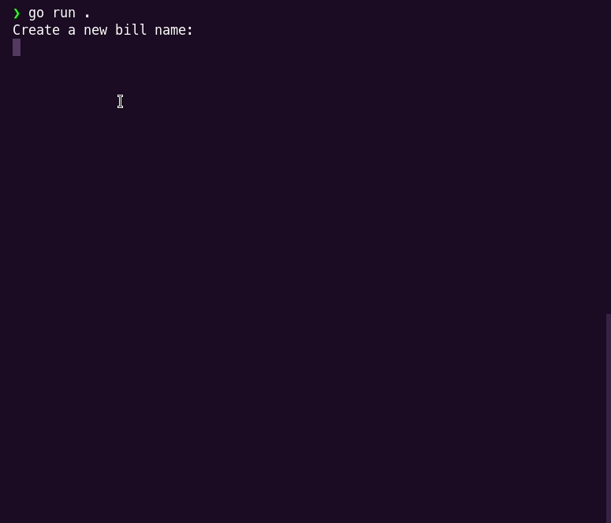

# GO-Bills

> Is a simple go project that records bills for some items and save the record to a file.

## Demo
Demo                         |
:---------------------------:|

## Built With

- GO

## Getting Started

- **To get a local copy of the repository please run the following commands on your terminal:**
  - Install [GO](https://go.dev/doc/install) if you don't have it installed
  - `git clone https://github.com/mmsesay/go-bills.git`
  - `cd go-bills`
  - `go run .` to start the app

👤 **Muhammad Sesay**

- GitHub: [@mmsesay](https://github.com/mmsesay)
- Twitter: [@DeeMaejor](https://twitter.com/DeeMaejor)
- LinkedIn: [LinkedIn](https://linkedin.com/in/muhammad-m-sesay)

## 🤝 Contributing

Contributions, issues, and feature requests are welcome!

Feel free to check the [issues page](../../issues/).

## Show your support

Give a ⭐️ if you like this project!

## Acknowledgments
- Microverse for the readme template
- Original design idea by [Gregoire Vella on Behance](https://www.behance.net/gregoirevella)